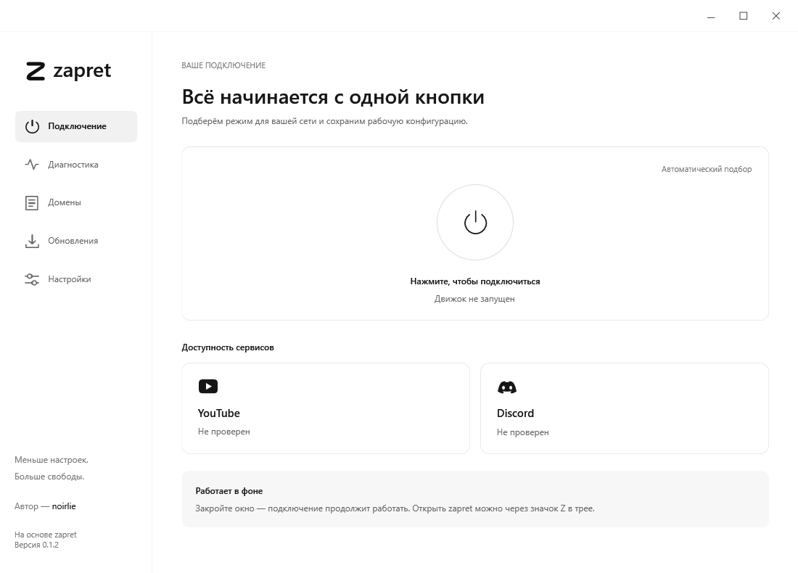
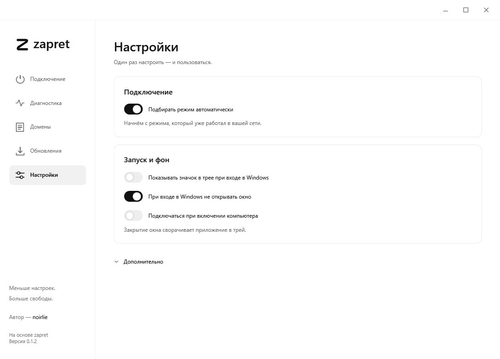
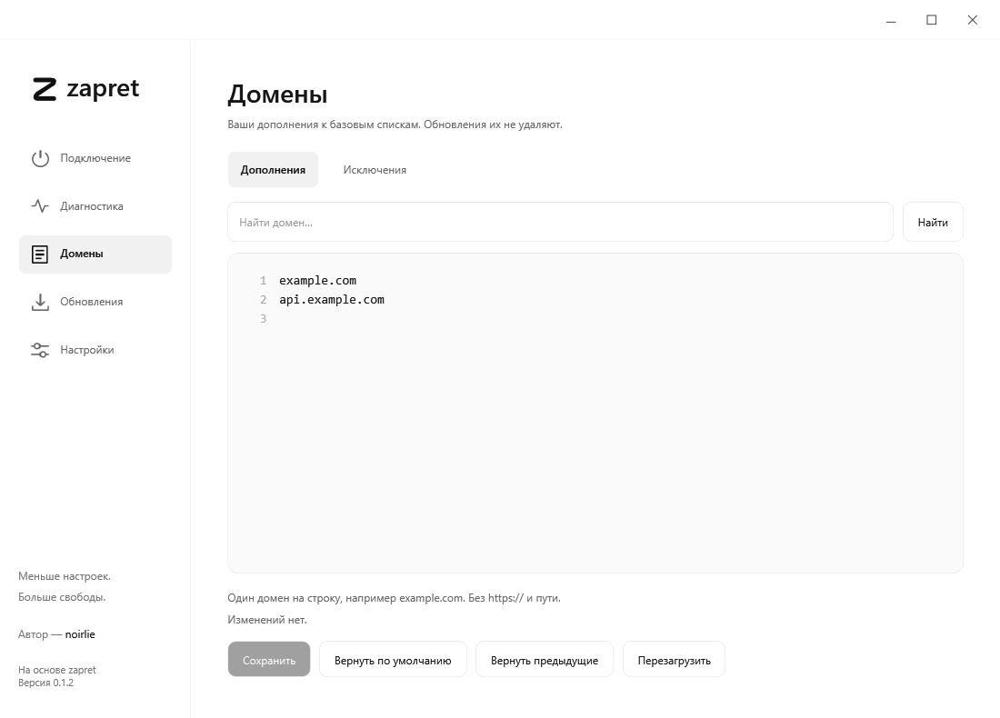
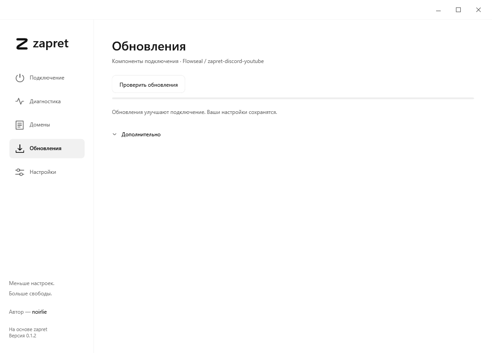

# zapret desktop

**Меньше настроек. Больше свободы.**

Светлое Windows-приложение для управления zapret: подключение одной кнопкой, автоматический подбор стратегии, работа в трее и обновление компонентов.

**Автор:** [noirlie](https://t.me/noirlie) · **Версия:** 0.1.2 · **Платформа:** Windows 10/11 x64

[Скачать установщик](https://github.com/noirlie/zapret-desktop/releases/latest) · [Исходный код](src) · [Сборка](BUILDING.md) · [Сообщить об ошибке](https://github.com/noirlie/zapret-desktop/issues)

> Самостоятельная оболочка на основе компонентов [Flowseal/zapret-discord-youtube](https://github.com/Flowseal/zapret-discord-youtube) и движка [bol-van/zapret](https://github.com/bol-van/zapret). Не официальный клиент Flowseal и не VPN.

## Что нового в 0.1.2

- Подключение после запуска Windows выполняет служба: сохранённый рабочий режим включается до фоновой проверки, без ожидания интерфейса.
- Появился редактор дополнительных доменов и исключений с поиском, проверкой записей, сбросом и восстановлением.
- Переработано белое меню трея со сглаженными углами; убрано уведомление о сворачивании.
- Исправлены чёрное окно при запуске, восстановление окна из трея, автоподбор и ложные выводы диагностики.
- Доработаны установка и удаление: выбор папки приложения, отдельная очистка настроек, обработка занятого драйвера WinDivert.
- Обновление компонентов сохраняет пользовательские списки и поддерживает откат при неудачной замене.

Полный список изменений — в [CHANGELOG.md](CHANGELOG.md).

## Скриншоты

### Подключение

### Настройки

### Домены

### Обновления

### Меню трея

Скриншоты сделаны в тестовом режиме без запущенной службы; состояние подключения на вашем ПК будет отличаться.

## Возможности

- Круглая кнопка подключения и отключения.
- Автоподбор: сначала проверяется сохранённая стратегия для текущей сети, затем остальные варианты.
- Ручной выбор стратегии при выключенном автоподборе.
- Диагностика доступности YouTube и Discord.
- Автономное автоподключение Windows-службы при включении компьютера — без ожидания интерфейса.
- Сохранённый режим запускается до диагностики; доступность проверяется в фоне.
- Работа в трее и отдельная настройка запуска значка при входе в Windows.
- Редактор дополнительных доменов и исключений: поиск, проверка записей, сброс и восстановление резервной копии.
- Восстановление подключения при изменениях сети и пробуждении: поведение зависит от стратегии и провайдера.
- Загрузка компонентов Flowseal с проверкой SHA-256, резервной копией и откатом.
- Белая тема, плавные переходы и умеренно скруглённое окно на Windows 11.

## Установка

1. Откройте [Releases](https://github.com/noirlie/zapret-desktop/releases/latest) и скачайте `ZapretSetup.exe`.
2. Запустите установщик, подтвердите запрос Windows и выберите папку приложения (можно на другом локальном диске). Служба и компоненты остаются в защищённой системной папке `%ProgramFiles%\ZapretDesktopService`. .NET включён в пакет.
3. Откройте **zapret** и нажмите круг подключения.

При обновлении закройте приложение через **«Выход» в трее**, затем запустите установщик повторно. Удалять приложение перед обновлением не нужно.

Закрытие окна скрывает его в трей и оставляет подключение активным. Команда **«Выйти»** пытается остановить подключение и завершает приложение.

## Быстрый запуск и домены

В настройках включите **«Подключаться при включении компьютера»**. Это настройка службы, независимая от **«Показывать значок в трее при входе в Windows»**. После обновления откройте приложение один раз для переноса прежней настройки. На следующем старте службы сохранённая стратегия запускается без ожидания окна и сетевых проверок. Если рабочего режима ещё нет, выполняется автоподбор. Windows может задерживать запуск интерфейса — это больше не задерживает уже настроенную службу.

Первая фоновая проверка выполняется примерно через 10 секунд после запуска службы, последующие — примерно раз в 45 секунд. Один неудачный ответ не переключает стратегию. Ручной режим не меняется автоматически. Фактическое время подключения зависит от готовности сети и Windows.

В разделе **«Домены»** редактируются только ваши дополнения и исключения, по одному домену на строку (до 6000 символов на список). Международные домены преобразуются в IDN, повторы удаляются; URL, пути и IP не принимаются. **«Вернуть по умолчанию»** очищает пользовательские дополнения и исключения, сохраняя базовые списки установленного пакета. Предыдущие сохранённые списки можно восстановить. Несохранённый текст в резервную копию не входит. Перед изменением активного подключения приложение предложит краткий перезапуск.

## Как это работает

Интерфейс WPF общается с локальной службой через Windows named pipe. Служба запускает `winws.exe` с аргументами из поддерживаемых стратегий. BAT-файлы анализируются как данные, а не исполняются произвольной командной оболочкой. WinDivert используется движком для обработки сетевых пакетов.

Автоподбор проверяет доступность HTTPS-сервисов и сохраняет рабочий вариант для сети. Успешная диагностика не гарантирует работу каждого сценария приложения или всех ресурсов у любого провайдера. При необходимости можно выбрать стратегию вручную.

Права администратора нужны установщику и обслуживанию службы, а не обычному окну приложения. Служба выполняется с системными правами; доступ к управляющему каналу ограничен владельцем установки, администраторами и SYSTEM.

Подробнее: [архитектура и сетевые обращения](docs/ARCHITECTURE.md).

## Исходники и прозрачность

В `src/` опубликованы исходники интерфейса и службы, в `installer/` — сценарий установщика, в `tests/` — проверки. Можно изучить код или [собрать приложение самостоятельно](BUILDING.md).

Для установщика в релизе опубликована SHA-256. Контрольная сумма помогает обнаружить изменение файла, но не является сертификатом безопасности. Независимый аудит и цифровая подпись издателя для 0.1.2 не заявлены. Исходники сторонних компонентов и их лицензии перечислены в [THIRD-PARTY-NOTICES.md](THIRD-PARTY-NOTICES.md).

Не отключайте защиту Windows ради установки: при обнаружении угрозы сначала проверьте источник файла и детали обнаружения.

## Обновления

- **Компоненты подключения:** проверяются и обновляются из репозитория Flowseal через приложение.
- **Само приложение:** в 0.1.2 обновляется повторным запуском установщика из этого репозитория. Встроенное автоматическое обновление оболочки ещё не реализовано.

## Данные и удаление

- Приложение: выбранная при установке папка (по умолчанию `%ProgramFiles%\Zapret`).
- Служба и компоненты: `%ProgramFiles%\ZapretDesktopService`.
- Настройки: `%LocalAppData%\ZapretDesktop.Alpha` — историческое имя папки сохранено для совместимости.

Удаление выполняется через настройки Windows или деинсталлятор. Перед удалением выйдите из приложения через трей. В окне удаления есть флажок **«Удалить все настройки и выбранные конфигурации»**: без него данные сохраняются для переустановки; с ним удаляются настройки владельца установки, списки, журналы, кеш пакетов и принадлежащие ему резервные копии службы. Если файл занят или обнаружена файловая ссылка, очистка сообщит об ошибке, а не выдаст ложный успех. Для смены папки уже установленного приложения сначала удалите его **без очистки настроек**, затем установите заново. Телеметрия и сервер автора для работы не используются; перечень сетевых запросов приведён в документации.

## Статус

Для версии 0.1.2 пройдены 12 локальных наборов тестов и собран установщик. Быстрый запуск и отсутствие чёрного окна проверялись после перезагрузки на машине разработки в ходе доводки 0.1.x. Полный сценарий установки и удаления 0.1.2 на чистой Windows ещё требует отдельного smoke-test. Работа на всех провайдерах и конфигурациях Windows не гарантируется. Отчёты об ошибках приветствуются; перед публикацией отчёта удалите личные пути, адреса и другие чувствительные данные.

## Лицензии и благодарности

Код оболочки — [MIT](LICENSE), автор **noirlie**. Сторонние компоненты распространяются по своим лицензиям, а не автоматически по MIT этой оболочки.

Спасибо **Flowseal**, **bol-van**, авторам **WinDivert**, **Cygwin**, **.NET** и **Inno Setup**. Подробности — [THIRD-PARTY-NOTICES.md](THIRD-PARTY-NOTICES.md).
